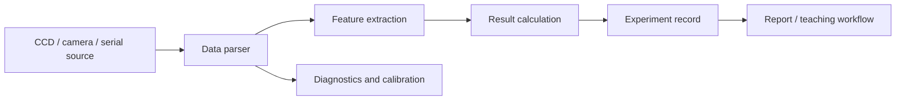

# Software Architecture Draft

```mermaid
flowchart LR
  A["CCD / camera / serial source"] --> B["Data parser"]
  B --> C["Feature extraction"]
  C --> D["Result calculation"]
  D --> E["Experiment record"]
  E --> F["Report / teaching workflow"]
  B --> G["Diagnostics and calibration"]
```

## Public-Safe Scope

This is an architecture abstraction, not a direct dump of the original desktop application or device program.

