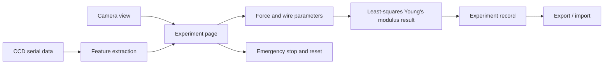

# Software Architecture

The desktop application is a WinUI 3 / .NET program for operating the Young's modulus instrument, recording measurements, and managing experiment data.

## Main Pages

- `HomePage`: quick access and experiment-record management.
- `TheoryPage`: principle introduction page reserved for teaching content.
- `ExperimentPage`: weight input, camera preview, serial CCD acquisition, real-time curve, parameter setting, data recording, fitting, import, and export.
- `CalibrationPage`: calibration page reserved for device adjustment.
- `SystemCheckPage`: system check page reserved for hardware status inspection.
- `SettingsPage`: version, team, and license information.

## Experiment Controls

- The CCD serial port list can be refreshed and selected from the UI.
- CCD integration time should be adjusted according to whether the intensity curve is clipped or has insufficient contrast.
- Wire diameter, original length, and CCD-to-wire ratio can be configured in the experiment page.
- The emergency stop button disables experiment controls while keeping camera/CCD observation available for recovery checks.
