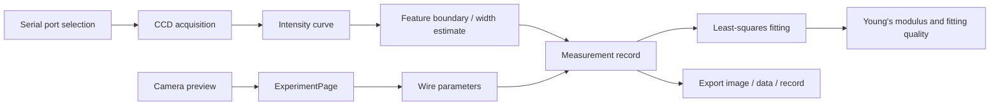

# Software Architecture

This document expands the software architecture from the operation guide. The complete extracted guide is available in `docs/software-operation-guide.md`, and the original Word file is preserved in `docs/source-materials/程序操作.docx`.

The desktop application is a WinUI 3 / .NET program for the Young's modulus instrument. It supports experiment navigation, CCD serial acquisition, camera observation, experiment records, import/export, parameter setting, real-time plotting, least-squares fitting, and emergency stop/reset.

For implementation-level pseudocode that follows the original C# program, see `docs/csharp-implementation-pseudocode.md`.


## Application Structure

```text
app/YoungsModuleTest/
  App.xaml / App.xaml.cs
  MainWindow.xaml / MainWindow.xaml.cs
  Views/
    HomePage.xaml
    TheoryPage.xaml
    ExperimentPage.xaml
    CalibrationPage.xaml
    SystemCheckPage.xaml
    SettingsPage.xaml
  Assets/
  Properties/
```

## Main Window

`MainWindow` provides the global frame:

- left navigation bar;
- page routing for the six main modules;
- power-button-style emergency stop control in the upper-right corner;
- reset path for recovering from abnormal experiment states.

The emergency stop logic is intentionally global rather than hidden inside the experiment page. In an experiment instrument, a stop button should be easy to find and independent of the current subview.

## Page Responsibilities

| Page | Responsibility |
|---|---|
| `HomePage` | Quick access to modules and local experiment-record management. |
| `TheoryPage` | Reserved principle-introduction page. |
| `ExperimentPage` | Main experiment UI: weight input, camera preview, CCD serial data, real-time curve, measurement recording, fitting, import, and export. |
| `CalibrationPage` | Reserved calibration page. |
| `SystemCheckPage` | Reserved system-check page. |
| `SettingsPage` | Version, platform, team, and license information. |

## Experiment Page Flow



## Key Functional Points

- The camera view is used for observation and can switch among available cameras.
- The CCD serial-port list can be refreshed in the UI.
- Integration time should be tuned according to the CCD curve: clipping at the lower boundary means the integration time should be reduced; insufficient contrast means it should be increased.
- Weight input accepts positive decimals and supports step adjustment.
- Wire parameters include diameter, effective length, and CCD scale factor.
- After two or more records are collected, the software performs least-squares fitting and reports Young's modulus and fitting quality.
- Experiment images, CCD raw data, and experiment records can be exported.

## Safety And Recovery

When emergency stop is activated:

- experiment-related controls are disabled;
- running experiment logic is stopped;
- camera and CCD observation can remain available so the operator can confirm whether the physical instrument has recovered;
- pressing the button again resets the state and re-enables the UI.
