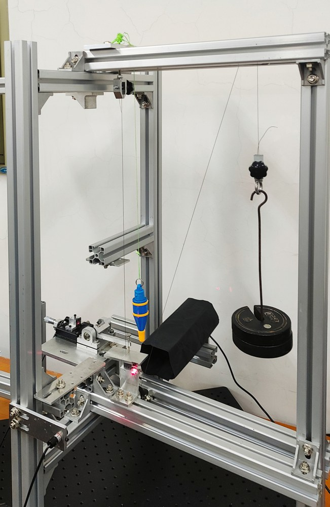
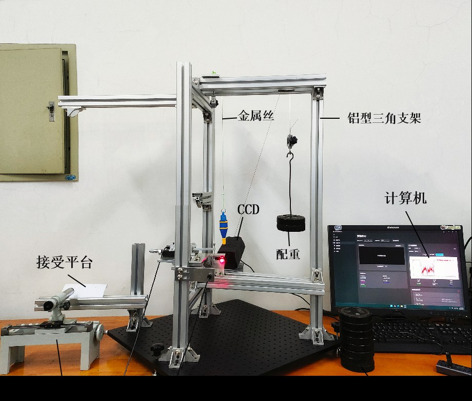
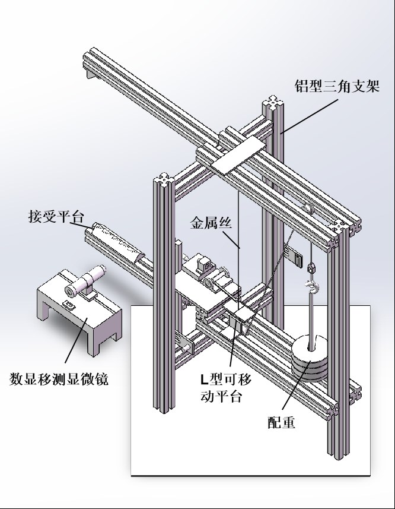
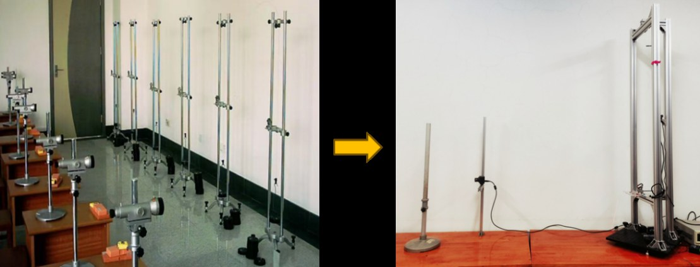
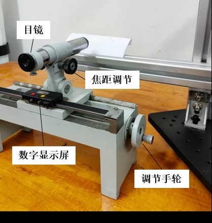
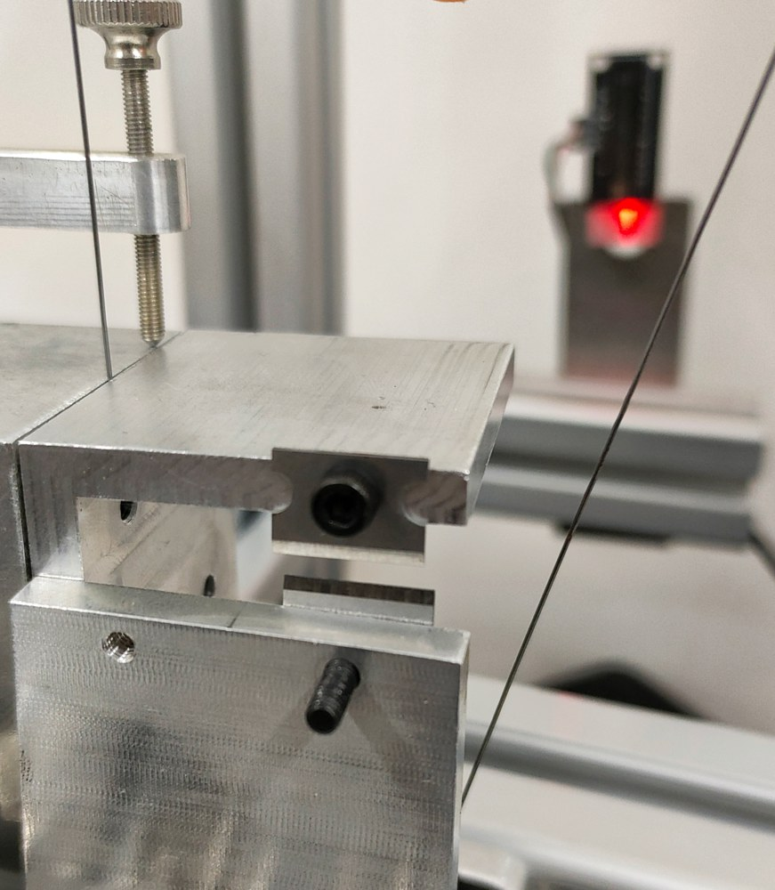
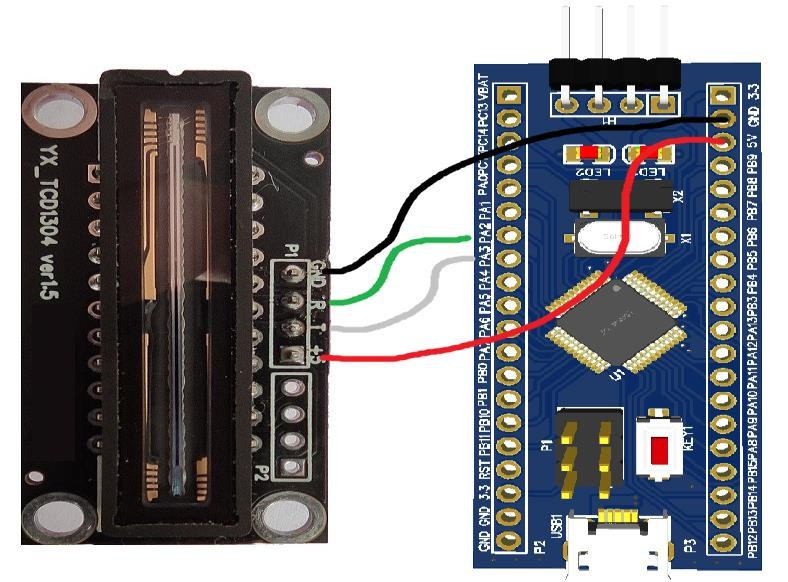
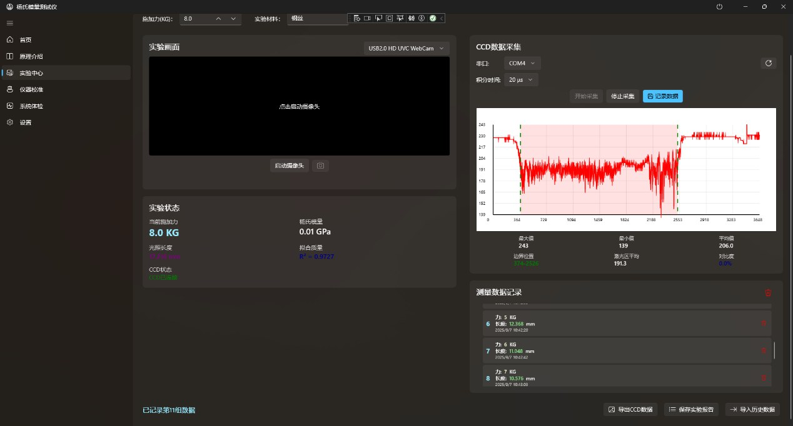

# Visual Supplement

These images are extracted from the original Word/PPT materials in `docs/source-materials/`. They are included so the Markdown documentation can be read visually on GitHub without downloading the office files first.

## Instrument Overview

## Mechanical And Optical Structure

## Projection Method And CCD Module

## Software Interface

